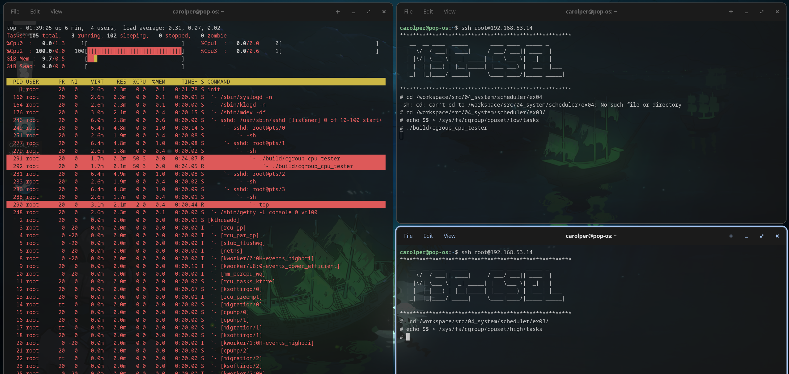
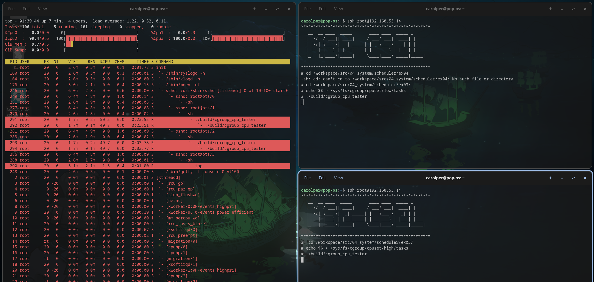
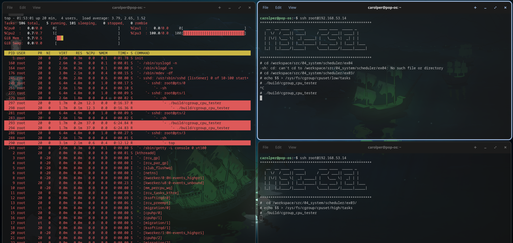

# CGroups

## Exercice #3: Afin de valider la capacité des groupes de contrôle de limiter l’utilisation des CPU, concevez une petite application composée au minimum de 2 processus utilisant le 100% des ressources du processeur.

Quelques indications pour monter les CGroups :

- Si ce n’est pas déjà effectué, monter le cgroup de l’exercice précédent (`mount -t tmpfs none /sys/fs/cgroup`).

    ```sh
    $ mkdir /sys/fs/cgroup/cpuset
    $ mount -t cgroup -o cpu,cpuset cpuset /sys/fs/cgroup/cpuset
    $ mkdir /sys/fs/cgroup/cpuset/high
    $ mkdir /sys/fs/cgroup/cpuset/low
    $ echo 3 > /sys/fs/cgroup/cpuset/high/cpuset.cpus
    $ echo 0 > /sys/fs/cgroup/cpuset/high/cpuset.mems
    $ echo 2 > /sys/fs/cgroup/cpuset/low/cpuset.cpus
    $ echo 0 > /sys/fs/cgroup/cpuset/low/cpuset.mems
    ```

#### Procédure de résolution de l'exercice

1. Monter le cgroup avec les nouveaux sous-systèmes :

    ```sh
    mkdir -p /sys/fs/cgroup/cpuset
    mount -t cgroup -o cpu,cpuset cpuset /sys/fs/cgroup/cpuset
    mkdir /sys/fs/cgroup/cpuset/high
    mkdir /sys/fs/cgroup/cpuset/low
    echo 3 > /sys/fs/cgroup/cpuset/high/cpuset.cpus
    echo 0 > /sys/fs/cgroup/cpuset/high/cpuset.mems
    echo 2 > /sys/fs/cgroup/cpuset/low/cpuset.cpus
    echo 0 > /sys/fs/cgroup/cpuset/low/cpuset.mems
    ```

2. Créer une application qui se fork une fois pour créer un deuxième processus. Les deux processus doivent utiliser 100% du CPU. Exemple basique du main :
```c
int main() {
    pid_t pid = fork();
    if (pid < 0) {
        perror("fork");
        return 1;
    } else {
        while (1) {
            // Utilisation intensive du CPU
        }
    }
    return 0;
}
```

3. On se base sur les instructions dans les questions ci-dessous pour placer les processus dans les cgroups "high" et "low" et observer le comportement.

#### Questions

Quelques questions :

1. Les 4 dernières lignes sont obligatoires pour que les prochaines commandes fonctionnent correctement. Pouvez-vous en donner la raison ?

    > Les lignes 4 à 7 permettent de configurer les cgroups "high" et "low" en spécifiant les CPU et la mémoire qu'ils peuvent utiliser. Les noms "high" et "low" sont arbitraires, mais ils servent à différencier les deux cgroups.

2. Ouvrez deux shells distincts et placez une dans le cgroup high et l’autre dans le cgroup low, par exemple :

    # ssh root@192.168.53.14
    $ echo $$ > /sys/fs/cgroup/cpuset/low/tasks

3. Lancez ensuite votre application dans chacun des shells. Quel devrait être le bon comportement ? Pouvez-vous le vérifier ?  
    Sachant que l’attribut cpu.shares permet de répartir le temps CPU entre différents cgroups, comment devrait-on procéder pour lancer deux tâches distinctes sur le cœur 4 de notre processeur et attribuer 75% du temps CPU à la première tâche et 25% à la deuxième ?


    Sans configurer de cpu.shares, on voit que, pour chaque cgroup, les deux processus du programme se partagent le CPU, utilisant à peu près 50% chacun.

    juste low
    

    les deux
    

    juste high
    


    Configuration des CPU shares
    ```bash
    echo 25 > /sys/fs/cgroup/cpuset/low/cpu.shares
    echo 75 > /sys/fs/cgroup/cpuset/high/cpu.shares
    ```

    Et coniguration de l'attribution des CPU pour donner le CPU 4 (numéro 3 parce que les CPU sont indexés à partir de 0) aux deux cgroups
    ```bash
    echo 3 > /sys/fs/cgroup/cpuset/high/cpuset.cpus
    echo 3 > /sys/fs/cgroup/cpuset/low/cpuset.cpus
    ```

    Ceci veut dire que si les deux cgroups veulent utilisent au max le même CPU, le cgroup "high" utilisera 75% du temps CPU, tandis que le cgroup "low" utilisera 25%. Cependant, si l'un des cgroups n'utilise pas tout son temps CPU, l'autre cgroup peut utiliser le temps CPU restant. 

    Maintenant avec cpu.shares configuré, on voit ceci :
    

    Si on calcule la somme de l'utilisation des deux processus dans chaque cgroup, on voit que le cgroup "high" utilise environ 75% du CPU, tandis que le cgroup "low" utilise environ 25%, ce qui correspond à la configuration des cpu.shares :
    - `12.3+12.3 = 24.6%` pour le cgroup "low"
    - `37 + 37 = 74%` pour le cgroup "high"

    On peut expliquer les chiffres non exacts par le fait que les processus héritent encore des shells qui les ont lancés, qui utilisent aussi du CPU.


